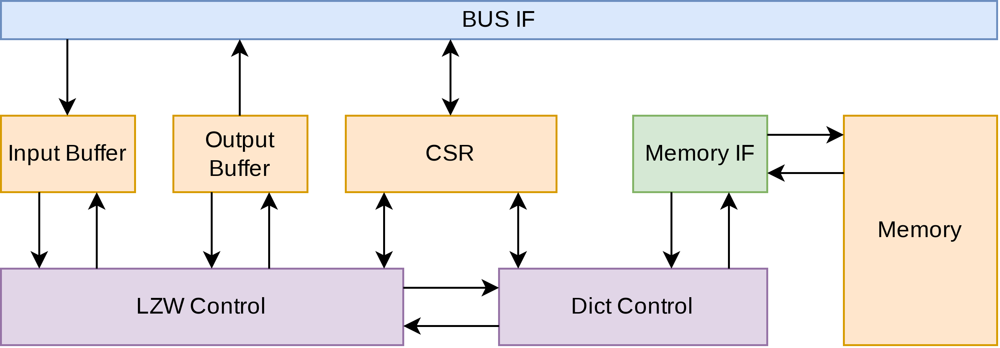

# LZW_DFHDL

Status:  
Not yet throughly tested.  
Simple memory and memory interface for reading of one dictionary entry at a time.  
Input/output buffer and BUS IF not implemented.  
Config and status register (CSR) only used for stop signaling.  

Implementation of a Lempel-Ziv-Welch Compression Accelerator in DFHDL\[1\]. Supported dictionary size is 4096 entries.

LZW Control: 
* ready valid signaling to interact with input and output buffers
* "top level" control (based on whether Dict Control found a matching entry)

Dict Control:
* iterates through dictionary (named memory in the image) 
* compares the index and symbol received from LZW Control to the entries from the dictionary
* adds new entries to dictionary

Memory IF:
* responsible for managing data exchanges depending on memory structure \[2\] 

CSR:
* config of LZW and Dict control (currently only sets a finish signal)
* receives status information from LZW and Dict control (currently LSB of status clears the finish signal)

\[1\] DFHDL (https://github.com/DFiantHDL/DFHDL) a Scala based HDL.

\[2\] Performance can be improved by having multiple (smaller) memories (with multiple ports) allowing more entries to be read in parallel. The memory IF is then responsible for loading the correct data and writing new entries to the correct memory based on the incoming address. The Dict Control can handle power of 2 number of entries.

